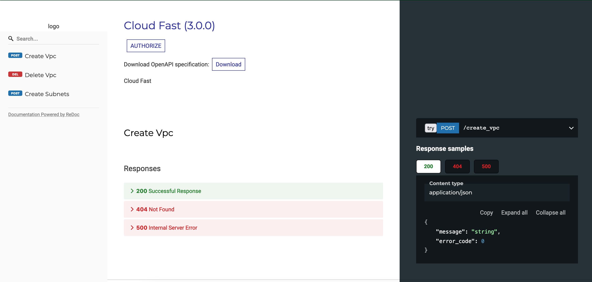

# CloudFast Automation Framework 🌩️🚀

The CloudFast Automation Framework is a powerful tool for automating your cloud infrastructure. With this framework, you can easily manage your cloud resources and automate repetitive tasks, all through a simple API and YAML-based configuration.

## Features

Accessible via API: The CloudFast Automation Framework can be easily integrated into your existing infrastructure and workflow, allowing you to automate tasks and manage resources through a simple API.

YAML configuration: The framework uses YAML for configuration, making it easy to read and understand. You can also use YAML to define your automation tasks and resources.

Cloud-agnostic: The CloudFast Automation Framework is designed to work with any cloud provider, allowing you to easily manage and automate tasks across multiple cloud environments.

Automate repetitive tasks: The framework can automate repetitive tasks such as creating, updating and deleting resources, scaling, etc.

## Instructions

1. Clone the repository by running the following command:

```
git clone https://github.com/rtiwariops/CloudFast.git
```

2. Change Directory.

```
cd CloudFast
```

3. Run the following script. (Make sure to change port in run.sh for any port conflicts)

```
./run.sh
```

4. Open the web URL.

```
http://localhost:5000/doc
```

5. You will see the following API documentation.


